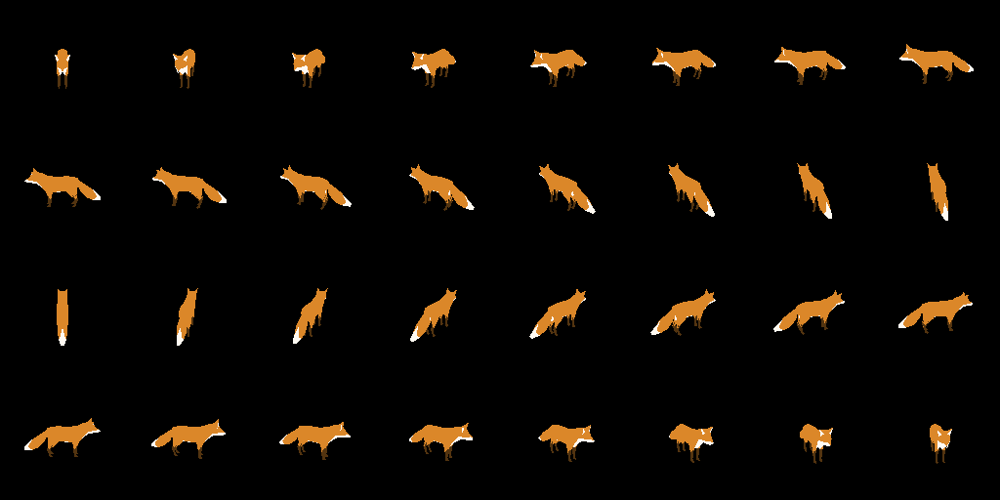

# flatten

a tool for rendering 3d objects to spritesheets

## example

this is a glTF 2.0 (.glb) model rendered at different angles into a spritesheet.



## usage

```
❯ ./flatten -h
flatten: a tool for rendering 3d objects to spritesheets (0.2)

USAGE
  $ flatten [options]  asset output 

FLAGS
  -h, --help                prints help
      --version             prints version
  -n, --noquit              don't close render immediately after capture

OPTIONS
  -d, --dimens value        render dimensions ('MxN')
  -w, --width value         spritesheet width (how many frames per row)
  -f, --frames value        number of frames to capture
  -l, --scale value         scale of object
  -r, --rot value           rotation of object ('X,Y,Z') (euler angles in deg)
  -c, --campos value        position of camera ('X,Y,Z')
  -g, --capangles value     angle range of the capture ('A,B') (in deg)

ARGUMENTS
  asset                     path to 3d asset (.obj or ,glb)
  output                    path to output spritesheet (.png)
```

for example:
```sh
./flatten ~/Downloads/mymodel1.glb captures.png -d 64x64 -w 4 -f 16 -l 5.5 -r 90,0,0 -c 14,14,14 -g 0,360 -n
```

## build

very easy, simply:
```sh
dub build
```
