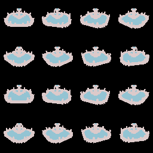

# flatten

a tool for rendering 3d objects to spritesheets

## example

this is a glTF 2.0 model rendered at different angles into a spritesheet.



## usage

```
❯ ./flatten -h
flatten: a tool for rendering 3d objects to spritesheets (0.1)

USAGE
  $ flatten [options]  asset output 

FLAGS
  -h, --help                prints help
      --version             prints version
  -n, --noquit              don't close render immediately after capture

OPTIONS
  -d, --dimens value        render dimensions
  -w, --width value         spritesheet width (how many frames per row)
  -f, --frames value        number of frames to capture
  -l, --scale value         scale of object
  -r, --rot value           rotation of object (euler angles in deg)
  -c, --campos value        position of camera
  -g, --capangles value     angle range of the capture (in deg)

ARGUMENTS
  asset                     path to 3d asset (.obj or ,glb)
  output                    path to output spritesheet (.png)
```

## build

very easy, simply:
```sh
dub build
```
